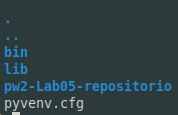
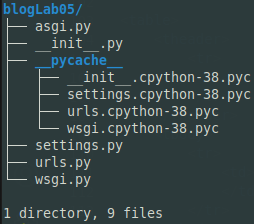
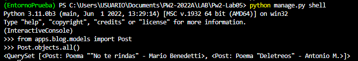
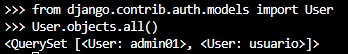
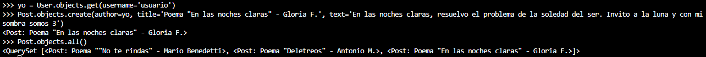
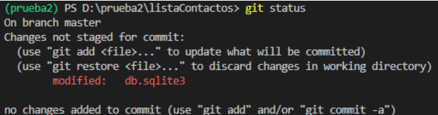

# Pw2-Lab05
<table>
    <theader>
        <tr>
            <td></td>
            <th>
                UNIVERSIDAD NACIONAL DE SAN AGUSTIN 
                FACULTAD DE INGENIERÍA DE PRODUCCIÓN Y SERVICIOS 
                ESCUELA PROFESIONAL DE INGENIERÍA DE SISTEMAS
            </th>
            <td></td>
        </tr>
    </theader>
    <tbody>
        <tr><td colspan="3">Formato: Guía de Práctica de Laboratorio / Talleres / Centros de Simulación</td></tr>
        <tr><td>Aprobación:  2022/03/01</td><td>Código: GUIA-PRLD-001</td><td>Página: 1</td></tr>
    </tbody>
</table>

    <h2>INFORME DE LABORATORIO</h2>

<table>
<theader>
    <tr><th colspan="6" style="width:50%; height:auto; text-align:center">INFORMACIÓN BÁSICA</th></tr>
</theader>
<tbody>
    <tr>
        <td>ASIGNATURA:</td><td colspan="5">Laboratorio de Programación Web 2</td>
    </tr>
    <tr>
        <td>TÍTULO DE LA PRÁCTICA:</td><td colspan="5">Django</td>
    </tr>
    <tr>
        <td>NÚMERO DE PRÁCTICA:</td><td>05</td><td>AÑO LECTIVO:</td><td>2022 A</td><td>NRO. SEMESTRE:</td><td>III</td>
    </tr>
    <tr>
        <td colspan="2">FECHA DE PRESENTACIÓN:</td><td>12-Jun-2022</td><td colspan="2">HORA DE PRESENTACIÓN:</td><td>23:55</td>
    </tr>
    <tr>
        <td colspan="3">INTEGRANTES:
        <ol>
        <li>Blanco Trujillo, Antony Jacob</li>
        <li>Cahuana Aguilar, Josué Mathías Miguel</li>
        <li>Hancco Velásquez, Jessica Geraldine</li>
        <li>Mayta Nolasco, Oliver Alessandro</li>
        <li>Umasi Cariapaza, Carlos Daniel</li>
        </ol>
        </td>
        <td colspan="2"> NOTA:</td>
        <td>     </td>
    </tr>
    <tr>
        <td colspan="6">DOCENTE: 
        Mg. Richart Smith Escobedo Quispe
        </td>
    </tr>
</tdbody>
</table>

<table>
    <theader>
        <tr>
            <th style="text-align:center">SOLUCIÓN Y RESULTADOS</th>
        </tr>
    </theader>
    <tbody>
        <tr>
            <td>
            I. SOLUCIÓN DE EJERCICIOS/PROBLEMAS 
            <ol>
                <li>Crea un blog sencillo en un entorno virtual utilizando la guía: https://tutorial.djangogirls.org/es/django_start_project/</li>
                    <ul>
                        <li>Creacion del entorno virtual con virtualenv</li>
                        Para la creacion y activación de se ejecutaron los siguientes comandos:
                        <pre>
        virtualenv -p python3 .
        source ./bin/activate</pre>
                         
                        Los archivos generados no se consideran para el repositorio
                        <li>Creacion del proyecto Django "blogLab05"</li>
                        <pre>
        pip install django
        cd pw2-Lab05-repositorio</pre>
                        Contenido del directorio "pw2-Lab05-repositorio", no incluido el ".git": 
                         
                        <li>Primera Migracion</li>
                        Despues de crear el proyecto se realiza migrate y ejecutamos el servidor:
                        <pre>
        python ./manage.py migrate
        python ./manage.py runserver</pre>
                        Luego podemos ver que se han creado nuevos archivos en el directorio del proyecto: 
                        <ul>
                            <li>Directorio ./__pycache__</li>
                        </ul>
                         
                        Y la base de datos para el proyecto segun como se configuró:
                        <ul>
                            <li>Archivo ./db.sqlite3</li>
                        </ul>
                    </ul>
                <li>Video tutorial donde se realicen las operaciones CRUD</li>
                <li>URL video: <a>https://youtu.be/8HVBwo2meDs</a></li>
            </ol>
            </td>
        </tr>
        <tr>
            <td>
            II. SOLUCIÓN DEL CUESTIONARIO 
            <ol>
                <li><b>¿Cuál es un estándar de codificación para Python? Ejemplo: Para PHP en el proyecto Pear https://pear.php.net/manual/en/standards.php</b></li>
                Realizando una búsqueda sencilla en internet se logra encontrar que python utiliza un estándar llamado PEP-8. Indica convenciones de escritura de código en python para hacerlo más legible.
                <li><b>¿Qué diferencias existen entre EasyInstall, pip, y PyPM?</b></li>
                EasyInstall / SetUpTools: Fue un instalador de paquetes de PyPI e instalador de dependencias automáticas, útil en su momento.
Pip: Es una mejora de EasyInstall ya que mejoró algunas funcionalidades como desinstalar paquetes o anular dependencias e introdujo la idea de los archivos de requisitos.
PyPM: Es un administrador de paquetes propio de ActivePython cuya utilidad es simplificar tareas de localización, instalación, actualización y eliminación de paquetes de Python.
                <li><b>En un proyecto Django que se debe ignorar para usar git. Vea: https://github.com/django/django/blob/main/.gitignore. 
¿Qué otros tipos de archivos se deberían agregar a este archivo?</b></li>
                Los archivos .gitignore contienen patrones que establecen coincidencias con los nombres de archivo de un repositorio para determinar si deberían ignorarse o no.
                <ul>
                    <li>db.sqlite 3 #Base de datos</li>
                    <li>__pycache__  #Directorio que guarda la ejecución de archivos .pyc, código compilado</li>
                    <li>/static o /packages o /modules #Directorios que almacenan los caches de dependencias</li>
                    <li>EntornoVirtual #Directorio de un entorno virtual creado</li>
                    <li>DS_Store #Archivos ocultos del sistema, archivos de cnfiguración de IDE</li>
                </ul>    
                <li><b>Utilice python manage.py shell para agregar objetos. ¿Qué archivos se modificaron al agregar más objetos? (Recomendacion, utilizar git si no hay gitignore)</b></li>
                Desde el SHELL se podrán probar los modelos, hacer consultas, analizar resultados, antes de elaborar las vistas. 
                El comando <code> python manage.py shell </code>abre una consola interactiva en Django, muy similar a la consola Python, que funciona con lenguaje Python.
                Para agregar objetos, primero, una vez dentro del shell, se importan los modelos(post) y podemos ver el listado de publicaciones Post  
                Para insertar objetos, agregar elementos, Post en la base de datos, se necesita importar al modelo usuario(User) que ya lo tiene Django y podemos ver que que contiene.  
                Después podemos crear instancas de algún usuario, superusuarios creados, y crear un objeto Post en la base de datos.
                  
                Finalmente con “git status”, se puede comprobar qué archivos fueron modificados.
                  
                Las consultas que se realizan en el Shell no se guardan en el proyecto, por lo tanto el único archivo que se modificó fue: “db.sqlite3”, la base de datos, ya que se agregó una nueva fila a la tabla.
            </ol>
            </td>
        </tr>
        <tr>
            <td>
                III. CONCLUSIONES 
                <ul>
                    <li>Podemos afirmar que Django es una gran herramienta, que cumple muy bien la función de “framework”; ya que nos proporciona un esqueleto muy bien pensado y solo debemos moldearlo a lo que nosotros queremos en nuestra app personalmente.</li>
                    <li>El shell nos ayuda con la realización de consultas a los modelos en Django sin afectar al proyecto, mostrandonos diferentes QuerySet, dependiendo de la consulta, para analizar resultados.</li>
                    <li>El uso de entornos virtuales permite configurar las versiones de Python y Django independientemente de los diferentes proyectos que se esten darrollando.</li>
                </ul>
            </td>
        </tr>
    </tbody>
</table>

<table>
    <theader>
        <tr>
            <th style="text-align:center">RETROALIMENTACIÓN GENERAL</th>
        </tr>
    </theader>
    <tbody>
        <tr>
            <td>
            </td>
        </tr>
    </tbody>
</table>

<table>
    <theader>
        <tr>
            <th style="text-align:center">REFERENCIAS Y BIBLIOGRAFÍA</th>
        </tr>
    </theader>
    <tbody>
        <tr>
            <td>
                [1] Escobedo, R., 2022. pw2/labs/lab01 at main · rescobedoq/pw2. [online] GitHub. Available at: https://github.com/rescobedoq/pw2/tree/main/labs/lab01. 
                [2] Curso Django: El Shell de Django, 2012. [online] MAESTROS DEL WEB by Platzi. Available at: http://www.maestrosdelweb.com/curso-django-el-shell-de-django/.
                [3] Instalación de Django, HonKit, 2022. [online] djangogirls.org. Available at: https://tutorial.djangogirls.org/es/django_installation/.
            </td>
        </tr>
    </tbody>
</table>
