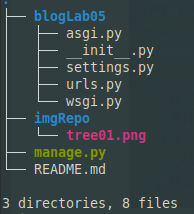

# Pw2-Lab05
<table>
    <theader>
        <tr>
            <td></td>
            <th>
                UNIVERSIDAD NACIONAL DE SAN AGUSTIN 
                FACULTAD DE INGENIERÍA DE PRODUCCIÓN Y SERVICIOS 
                ESCUELA PROFESIONAL DE INGENIERÍA DE SISTEMAS
            </th>
            <td></td>
        </tr>
    </theader>
    <tbody>
        <tr><td colspan="3">Formato: Guía de Práctica de Laboratorio / Talleres / Centros de Simulación</td></tr>
        <tr><td>Aprobación:  2022/03/01</td><td>Código: GUIA-PRLD-001</td><td>Página: 1</td></tr>
    </tbody>
</table>

    <h2>INFORME DE LABORATORIO</h2>

<table>
<theader>
    <tr><th colspan="6" style="width:50%; height:auto; text-align:center">INFORMACIÓN BÁSICA</th></tr>
</theader>
<tbody>
    <tr>
        <td>ASIGNATURA:</td><td colspan="5">Laboratorio de Programación Web 2</td>
    </tr>
    <tr>
        <td>TÍTULO DE LA PRÁCTICA:</td><td colspan="5">Django</td>
    </tr>
    <tr>
        <td>NÚMERO DE PRÁCTICA:</td><td>05</td><td>AÑO LECTIVO:</td><td>2022 A</td><td>NRO. SEMESTRE:</td><td>III</td>
    </tr>
    <tr>
        <td colspan="2">FECHA DE PRESENTACIÓN:</td><td>09-KJun-2022</td><td colspan="2">HORA DE PRESENTACIÓN:</td><td>23:55</td>
    </tr>
    <tr>
        <td colspan="3">INTEGRANTES:
        <ol>
        <li>Blanco Trujillo, Antony Jacob</li>
        <li>Cahuana Aguilar, Josué Mathías Miguel</li>
        <li>Hancco Velásquez, Jessica Geraldine</li>
        <li>Mayta Nolasco, Oliver Alessandro</li>
        <li>Umasi Cariapaza, Carlos Daniel</li>
        </ol>
        </td>
        <td colspan="2"> NOTA:</td>
        <td>     </td>
    </tr>
    <tr>
        <td colspan="6">DOCENTE: 
        Mg. Richart Smith Escobedo Quispe
        </td>
    </tr>
</tdbody>
</table>

<table>
    <theader>
        <tr>
            <th style="text-align:center">SOLUCIÓN Y RESULTADOS</th>
        </tr>
    </theader>
    <tbody>
        <tr>
            <td>
            I. SOLUCIÓN DE EJERCICIOS/PROBLEMAS 
            <ul>
                <li>Creacion del entorno virtual con virtualenv</li>
                Para la creacion y activación de se ejecutaron los siguientes comandos:
                <pre>
virtualenv -p python3 .
source ./bin/activate</pre>
                 
                Los archivos generados no se consideran para el repositorio
                <li>Creacion del proyecto Django "blogLab05"</li>
                <pre>
pip install django
cd pw2-Lab05-repositorio</pre>
                Contenido del directorio "pw2-Lab05-repositorio", no incluido el ".git": 
                 
                <li>Primera Migracion</li>
                Despues de crear el proyecto se realiza migrate y ejecutamos el servidor:
                <pre>
python ./manage.py migrate
python ./manage.py runserver</pre>
                Luego podemos ver que se han creado nuevos archivos en el directorio del proyecto: 
                <ul>
                    <li>Directorio ./__pycache__</li>
                </ul>
                 
                Y la base de datos para el proyecto segun como se configuró:
                <ul>
                    <li>Archivo ./db.sqlite3</li>
                </ul>
            </ul>
            </td>
        </tr>
        <tr>
            <td>
            II. SOLUCIÓN DEL CUESTIONARIO 
            </td>
        </tr>
        <tr>
            <td>
            III. CONCLUSIONES 
            </td>
        </tr>
    </tbody>
</table>

<table>
    <theader>
        <tr>
            <th style="text-align:center">RETROALIMENTACIÓN GENERAL</th>
        </tr>
    </theader>
    <tbody>
        <tr>
            <td>
            </td>
        </tr>
    </tbody>
</table>

<table>
    <theader>
        <tr>
            <th style="text-align:center">REFERENCIAS Y BIBLIOGRAFÍA</th>
        </tr>
    </theader>
    <tbody>
        <tr>
            <td>
                [1] Escobedo, R., 2022. pw2/labs/lab01 at main · rescobedoq/pw2. [online] GitHub. Available at: https://github.com/rescobedoq/pw2/tree/main/labs/lab01. 
                [2] Proyectos de tecnología con arduino, 2022. Manejo de ramas de Git, en vs code . (branch). [video] Available at: https://www.youtube.com/watch?v=k8UlMFtNDpE.
            </td>
        </tr>
    </tbody>
</table>
